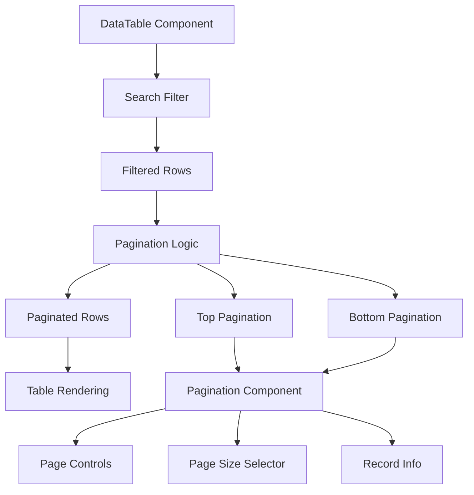

# Pagination Implementation Plan

## Overview

Implement full-featured pagination for the DataTable component with controls at both top and bottom, page size selector, and comprehensive edge case handling.

## Architecture



## Implementation Details

### 1. Create Pagination Component

**File:** `react-datatable/src/RactDataTable/Components/Pagination.jsx`

- **Features:**
  - First, Previous, Page Numbers, Next, Last buttons
  - Page size selector dropdown (10, 25, 50, 100 options)
  - Record count display (e.g., "Showing 1-10 of 100 records")
  - Total pages display
  - Disabled states for edge cases (first/last page)
  - Responsive design

- **Props:**
  - `currentPage`: Current active page (1-indexed)
  - `totalPages`: Total number of pages
  - `pageSize`: Items per page
  - `totalRecords`: Total number of records
  - `onPageChange`: Callback for page changes
  - `onPageSizeChange`: Callback for page size changes
  - `startIndex`: Starting record index (0-indexed)
  - `endIndex`: Ending record index (0-indexed)

- **Edge Cases:**
  - Hide pagination when totalRecords = 0
  - Disable First/Previous on page 1
  - Disable Next/Last on last page
  - Show ellipsis for large page counts
  - Handle single page scenario

### 2. Update DataTable Component

**File:** `react-datatable/src/RactDataTable/Pages/DataTable.jsx`

- **New State:**
  - `currentPage`: Current page number (default: 1)
  - `pageSize`: Items per page (default: 10)

- **New Props (optional):**
  - `showTopPagination`: Boolean, default true
  - `showBottomPagination`: Boolean, default true
  - `defaultPageSize`: Number, default 10
  - `pageSizeOptions`: Array, default [10, 25, 50, 100]

- **Logic Updates:**
  - Reset to page 1 when search changes
  - Reset to page 1 when pageSize changes
  - Calculate paginated rows from filtered rows
  - Pass correct indices to Pagination component
  - Maintain selection state across pages (if needed)

- **Rendering:**
  - Render top pagination after header, before table
  - Render bottom pagination after table
  - Conditionally show/hide based on props

### 3. Add Pagination Styles

**File:** `react-datatable/src/RactDataTable/CSS/DataTable.module.css`

- **Styles for:**
  - Pagination container (flexbox layout)
  - Navigation buttons (First, Prev, Next, Last)
  - Page number buttons with active state
  - Page size selector dropdown
  - Record info text
  - Disabled button states
  - Responsive breakpoints
  - Hover and focus states

### 4. Edge Cases to Handle

1. **Empty Data:**

   - Hide pagination when no records
   - Show "No records" message

2. **Search Integration:**

   - Paginate filtered results, not all rows
   - Reset to page 1 on search change
   - Update total records count based on filtered results

3. **Single Page:**

   - Show pagination but disable navigation buttons
   - Display "Showing 1-X of X records"

4. **Page Size Changes:**

   - Reset to page 1 when page size changes
   - Recalculate total pages

5. **Large Page Counts:**

   - Show ellipsis (...) for pages far from current
   - Show first, last, and pages around current
   - Example: [1] ... [5] [6] [7] ... [20]

6. **Selection State:**

   - Consider if selection should persist across pages
   - Update "select all" to work with current page only

### 5. Component Structure

```
DataTable
├── Header (Search)
├── Top Pagination (conditional)
├── Table
│   ├── Header Row
│   └── Data Rows (paginated)
└── Bottom Pagination (conditional)
```

## Files to Modify

1. **Create:** `react-datatable/src/RactDataTable/Components/Pagination.jsx`
2. **Modify:** `react-datatable/src/RactDataTable/Pages/DataTable.jsx`
3. **Modify:** `react-datatable/src/RactDataTable/CSS/DataTable.module.css`
4. **Update:** `react-datatable/README.md` (documentation)

## Testing Considerations

- Test with 0 records
- Test with records less than page size
- Test with exactly page size
- Test with many pages (100+)
- Test search + pagination interaction
- Test page size changes
- Test navigation buttons (First, Prev, Next, Last)
- Test responsive design
- Test selection state with pagination

## User Experience Enhancements

- Smooth transitions between pages
- Clear visual feedback for active page
- Accessible keyboard navigation
- Mobile-friendly touch targets
- Loading states (if needed for future)
- Clear indication of current position (e.g., "Page 3 of 10")